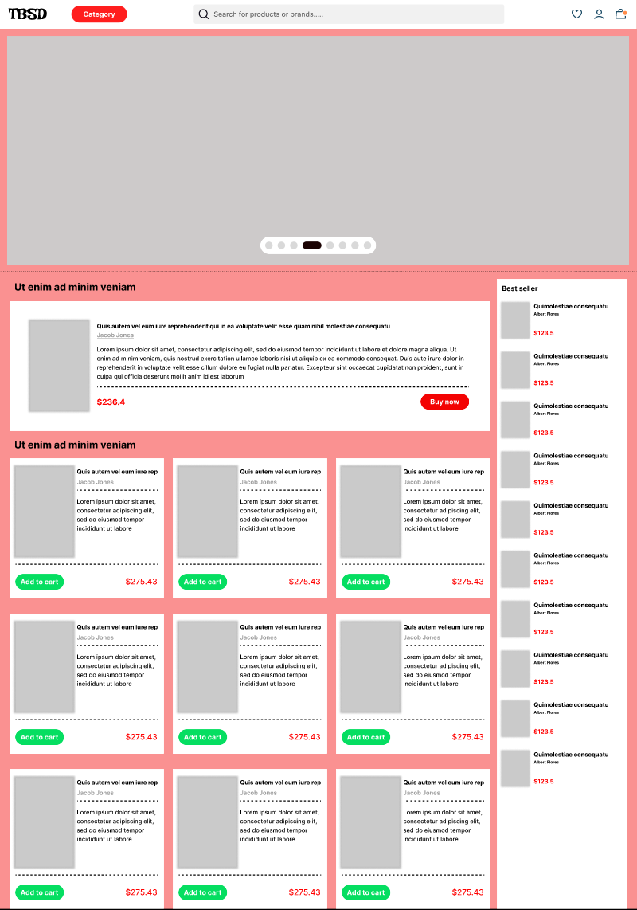
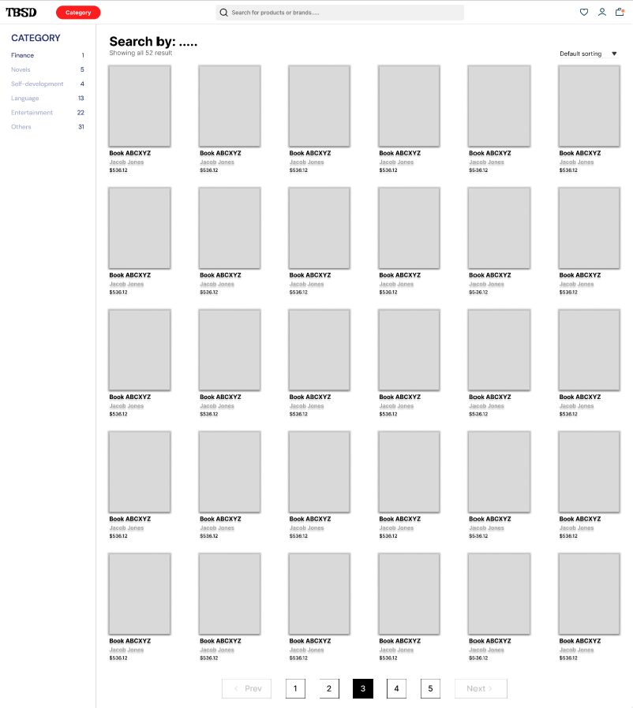
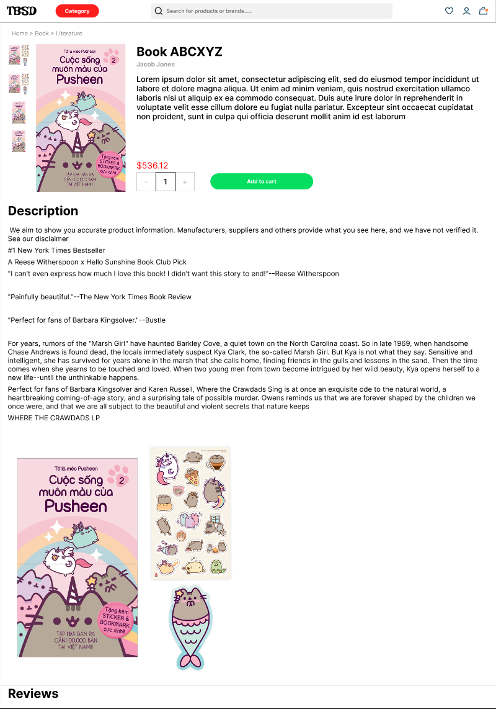
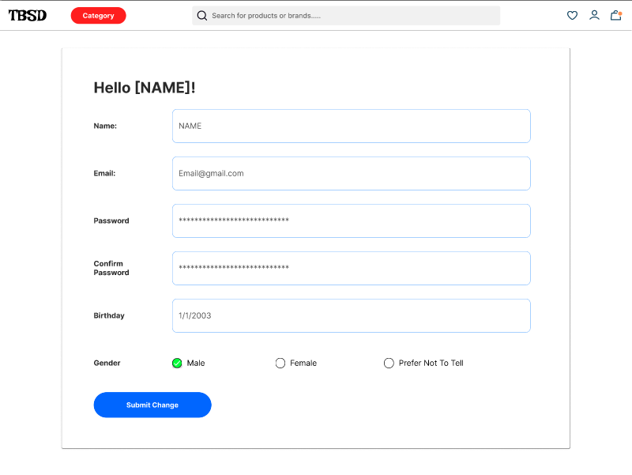
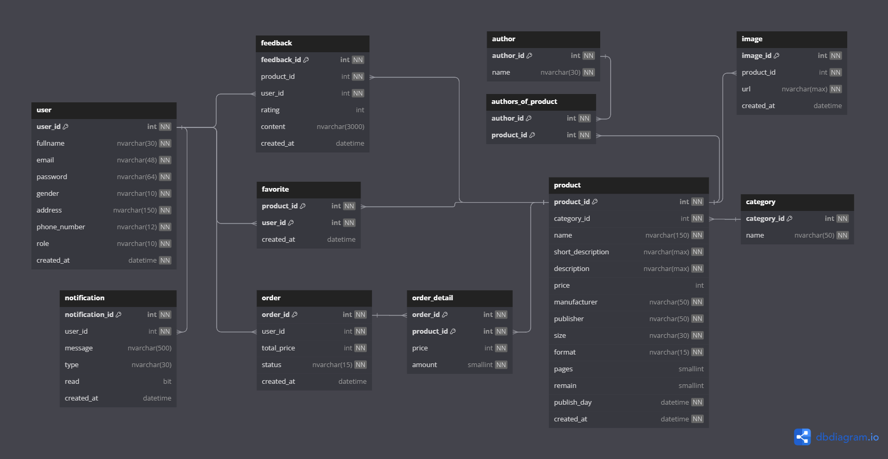

# Assignment

## 1. Team member:

- Phan Phạm Hòa SE171730
- Huỳnh Duy Anh SE182336
- Lê Thế Trường SE182338

### 2. Requirements:

#### 2.1. Name of the system:

- Tôi bán sách dạo

#### 2.2. Purpose of the system:

- Create a platform to support the seller in accessing with customers easier
- Display a comprehensive catalog of books
  - Genres (Fantasy, Adventure, Mystery, Science, etc)
  - Book publisher
  - New-listing books
  - Bestseller books
- Allow customers to create accounts to buy books and manage their order history.

#### 2.3. User of the system:

| No. | Actor | Detail                                                                          |
| --- | ----- | ------------------------------------------------------------------------------- |
| 1   | Guest | User who hasn’t registered into the system                                      |
| 2   | User  | User who has registered into the system                                         |
| 3   | Staff | Employee of the bookstore, take responsible for managing products in the system |
| 4   | Admin | Administrator of the bookstore, take responsible for managing staffs            |

#### 2.4. List of feature:

#### _Guest_

| No. | Use case          | Description                                  |
| --- | ----------------- | -------------------------------------------- |
| 1   | Register          | Create a new account                         |
| 2   | Login             | Log in into an existing account              |
| 3   | Recover account   | Recover when forgetting password             |
| 4   | Search for book   | Search for book by keyword, sort by criteria |
| 5   | View books        | View all books in selected categories        |
| 6   | View book details | View details of a specific book              |

#### _User_

| No. | Use case                     | Description                         |
| --- | ---------------------------- | ----------------------------------- |
| 1   | Logout                       | Log out the current account         |
| 2   | Update info                  | Update account information/password |
| 3   | View shop cart               | View books in the cart              |
| 4   | Change shop cart item amount | Add/substract the current amount    |
| 5   | Add shop cart item           | Add new item to the cart            |
| 6   | Remove shop cart item        | Remove an item from the cart        |
| 7   | Purchase                     | Continue to payment                 |
| 8   | Feedback                     | Write review for purchased books    |

#### _Staff_

| No. | Use case    | Description                         |
| --- | ----------- | ----------------------------------- |
| 1   | Add book    | List a new book                     |
| 2   | Update book | Update book information, stock, etc |
| 3   | Delete book | Delist a book                       |

#### _Admin_

| No. | Use case       | Description |
| --- | -------------- | ----------- |
| 1   | View statistic |             |
| 2   | Add staff      |             |
| 3   | Delete staff   |             |
| 4   | Update staff   |             |

### 2.5. Statistics

- Overall statistics:
  - Number of books sold
  - Number of best-selling books
  - Total revenue
- Book statistics
  - Number of copies sold
  - Number of page visits
  - Average feedback rating

(\*) Time: per-day, week, month

## 3. Wireframe

#### _Home page_

#### _Search page_

#### _Product detail_

#### _Account detail_

#### _Admin dashboard_

#### _Manage books_

#### _Create book_

## 4. Database model

## 5. Database data
Crawl from Tiki + generate fake users.

